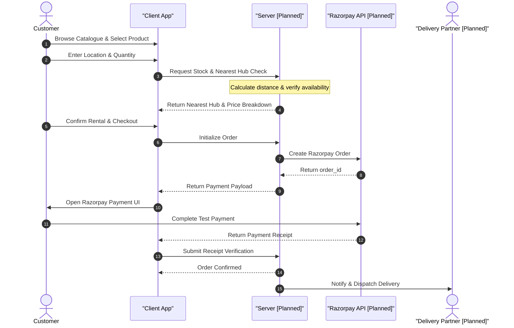

# REXPO — Rental Management System

> A full-stack rental management platform designed to connect customers, hubs, sub-admins, delivery partners, and a centralized super-admin through a unified rental marketplace and inventory management system.


---

## Overview

**REXPO** is a rental management system that provides a centralized platform for managing rental products, hub inventory, customers, orders, payments, delivery partners, and administrative operations. 

The system follows a role-based architecture where each user has access only to the functionality required for their role. The major roles are:
- **Customer**
- **Sub-Admin / Hub Admin**
- **Delivery Partner / Rider**
- **Super Admin**

The platform allows customers to browse rental products, check availability, select rental duration, identify the nearest hub, place rental orders, and proceed to Razorpay test payment. Sub-admins manage their respective hubs, inventory, rental products, and delivery partners. The Super Admin has a centralized view of the platform and can monitor the sub-admins and marketplace activity across the system.

---

## Current Project Status & Accuracy Notice

> [!IMPORTANT]
> **Prototype Frontend Status**
> The current workspace (`odoo_code/`) contains the frontend React/Vite prototype (which is built using the **Nexus HRMS** template). The full-stack REXPO Rental Management System (including backend services, live PostgreSQL database, Cloudinary integrations, Razorpay payments, and WhatsApp rider dispatch) represents the **Target Specification** and is planned for full implementation. 
> 
> Unimplemented full-stack features are explicitly labeled as **[Planned / Future Functionality]** in this documentation to maintain complete alignment with the existing codebase.

---

# System Architecture

```text
                         ┌──────────────────────┐
                         │      SUPER ADMIN      │
                         │ Central Administration│
                         └──────────┬───────────┘
                                    │
                     ┌──────────────┴──────────────┐
                     │                             │
              ┌──────▼──────┐              ┌──────▼──────┐
              │  SUB-ADMIN   │              │   SYSTEM    │
              │  / HUB ADMIN │              │ MONITORING  │
              └──────┬──────┘              └─────────────┘
                     │
          ┌──────────┼──────────┐
          │          │          │
     Inventory    Orders    Delivery
          │          │        Partners
          │          │          │
          └──────────┼──────────┘
                     │
              ┌──────▼──────┐
              │   CUSTOMER  │
              │ Marketplace │
              └──────┬──────┘
                     │
              Browse / Rent
                     │
              ┌──────▼──────┐
              │   PAYMENT   │
              │  RAZORPAY   │
              │ TEST MODE   │
              └─────────────┘
```

---

# Core Features

## 1. Customer Functionality [Planned]
Customers can access the marketplace to:
- Browse available rental products and view high-quality images.
- Check real-time availability of items.
- Select rental quantity and duration.
- Provide delivery locations to automatically find the nearest suitable hub.
- View distinct breakdowns of the Rental Amount and Security Deposit.
- Create a Razorpay test order and complete the checkout payment flow.
- View unified rental and order status information.

## 2. Marketplace & Browse Catalogue [Planned]
- Displays products available through the nearest connected hubs.
- Prevents orders of unavailable items by verifying stock counts prior to checkout.

## 3. Hub Inventory Management [Planned]
Sub-admins manage individual hub inventories containing:
- Product name, information, and status.
- Total vs. available quantities.
- Rental pricing and security deposit specifications.
- Cloudinary-hosted product images.

## 4. Cloudinary Image Management [Planned]
Product images are managed securely through Cloudinary:
```text
Sub-Admin Uploads Image ──> Backend API ──> Cloudinary Storage
                                                 │
Catalogue Display <── Database Product Record <── Secure Image URL
```
*Note: Credentials remain securely in environment variables and are never hardcoded on the frontend.*

## 5. Rental Availability Check [Planned]
Stock is validated server-side prior to order creation:
```text
Customer selects product & quantity
        │
        ▼
Selects rental duration
        │
        ▼
System checks inventory
        │
   ┌────┴────┐
  YES        NO ──> Stop order
   │
   ▼
Calculate rental + deposit
   │
   ▼
Create payment order
   │
   ▼
Razorpay Test Checkout
```

## 6. Location & Nearest Hub Calculation [Planned]
- The system determines the customer's delivery location.
- Identifies the nearest hub having the requested product available in the required quantity.

## 7. Rental & Security Deposit Calculation [Planned]
- Separates **Rental Fee**, **Security Deposit**, and any **Additional Charges**.
- Validated on the backend prior to checkout to ensure financial integrity.

## 8. Razorpay Test Integration [Planned]
Integrates Razorpay in TEST MODE for end-to-end checkout flow validation:
```text
Confirm Rental ──> Backend Stock Validation ──> Calculate Payable Amount
                                                      │
Rental Order Status <── Test Payment <── Razorpay Checkout <── Create Test Order
```

## 9. Super Admin Dashboard [Planned]
- Centralized read-only monitoring of all sub-admins, hubs, products, and system-wide orders.
- Setup via environment variables (created only once on initial setup).
- Basic username/password login (no OTP required). Password changes require the existing password.

## 10. Sub-Admin / Hub Admin [Planned]
- Hub-level isolated inventory, product upload, and delivery partner management.
- Authorization limits sub-admins strictly to their assigned hub.

## 11. Delivery Partner / Rider Workspace [Planned]
Riders are managed by Sub-Admins and receive auto-generated credentials:
```text
Sub-Admin Adds Rider ──> System Generates Password ──> Sent via WhatsApp Integration
                                                               │
Delivery Workspace <── Rider Sign-in <─────────────────────────┘
```
- Riders can view assigned deliveries, customer location details, and update delivery status.

---

# Order Flow & API Roadmaps

## Complete Order Fulfillment Flow


## Core Workflows [Planned]
- **Authentication**: Credentials verification via JWT token generation.
- **Inventory & Image Upload**: Multi-part upload to Cloudinary saving secure URLs into database records.
- **Location Processing**: Nearest-neighbor search matching customer coordinates to active hubs with available stock.

---

# Role Permissions

| Feature | Customer | Sub-Admin | Delivery Partner | Super Admin | Workspace Implementation Status |
| :--- | :---: | :---: | :---: | :---: | :--- |
| **Browse Catalogue** | 🟢 | 🟢 | — | 🟢 | 🔬 *Mock Prototype (HRMS Directory)* |
| **View Products** | 🟢 | 🟢 | — | 🟢 | 🔬 *Mock Prototype (HRMS Profiles)* |
| **Rent Product** | 🟢 | — | — | — | 📅 *Planned Future Feature* |
| **Manage Inventory** | — | 🟢 | — | 🟢 | 📅 *Planned Future Feature* |
| **Upload Product Images** | — | 🟢 | — | 🟢 | 📅 *Planned Future Feature* |
| **Manage Hub** | — | 🟢 | — | 🟢 | 📅 *Planned Future Feature* |
| **Manage Riders** | — | 🟢 | — | 🟢 | 📅 *Planned Future Feature* |
| **View Assigned Deliveries** | — | 🟢 | 🟢 | 🟢 | 📅 *Planned Future Feature* |
| **Process Delivery** | — | — | 🟢 | 🟢 | 📅 *Planned Future Feature* |
| **View Marketplace** | 🟢 | 🟢 | — | 🟢 | 📅 *Planned Future Feature* |
| **View Sub-Admins** | — | — | — | 🟢 | 📅 *Planned Future Feature* |
| **Manage Super Admin** | — | — | — | 🟢 | 📅 *Planned Future Feature* |
| **Razorpay Test Payment** | 🟢 | — | — | — | 📅 *Planned Future Feature* |

---

# Security

The platform aligns with these secure software principles:
1. **Role-Based Access Control (RBAC)**: Enforced clientside via routes and server-side via middleware.
2. **Server-Side Calculations**: All rental charges, deposits, and stock checks occur strictly on the backend.
3. **No Hardcoded Secrets**: Cloudinary, database, and Razorpay tokens are read exclusively from environment variables.
4. **Hub Isolation**: Sub-admins are restricted strictly to database queries referencing their authorized hub ID.

---

# Tech Stack

| Category | Technologies | Version / Implementation Status |
| :--- | :--- | :--- |
| **Core UI** |  **React** | `^19.2.7` *(Actual)* |
| **Routing** |  **React Router DOM** | `^7.18.1` *(Actual)* |
| **HTTP Client** |  **Axios** | `^1.18.1` *(Actual)* |
| **Icons** |  **Lucide React** | `^1.23.0` *(Actual)* |
| **Bundler & Server**|  **Vite** | `^8.1.1` *(Actual)* |
| **Linter** |  **Oxlint** | `^1.71.0` *(Actual)* |
| **Backend API** |  **Node.js / Express.js** | 📅 *Planned* |
| **Database** |  **PostgreSQL** | 📅 *Planned* |
| **Image Hosting** |  **Cloudinary** | 📅 *Planned* |
| **Payment Gateway** |  **Razorpay Test Mode** | 📅 *Planned* |
| **Notifications** |  **WhatsApp API** | 📅 *Planned* |

---

# Project Structure

The project currently consists of a frontend React application under the `odoo_code/` folder:

```text
odoo_code/
├── src/
│   ├── assets/                 # App assets (Vite/React svgs, mockup graphics)
│   ├── components/             # Reusable UI elements (Header, Sidebar, StatCards)
│   ├── context/                # Context wrappers (Toast notifications)
│   ├── layouts/                # Base layouts (EmployeeLayout, AdminLayout)
│   ├── pages/                  # Landing, Login, Register, Dashboards
│   ├── services/               # Mock data (mockData.js) and API endpoints (api.js)
│   ├── styles/                 # global variables and custom CSS files
│   ├── App.css
│   ├── App.jsx                 # Route configurations
│   ├── index.css               # Core styling variables
│   └── main.jsx                # Application root
├── public/                     # Static files
├── package.json                # Project configurations & dependencies
├── vite.config.js              # Vite packaging definitions
└── .oxlintrc.json              # Oxlint configurations
```

---

# Environment Variables

Create a `.env` file in the root workspace directory to configure the application server (placeholders only, do not expose secrets):

```env
PORT=5000
JWT_SECRET=your-secure-jwt-secret-key-here

# MySQL Database Configuration
DB_HOST=127.0.0.1
DB_PORT=3306
DB_USER=root
DB_PASSWORD=your_mysql_password
DB_NAME=rental

# Google OAuth2 & Gmail Email Service Configuration
# Obtain credentials from Google Cloud Console (https://console.cloud.google.com/)
GOOGLE_CLIENT_ID=your_google_client_id.apps.googleusercontent.com
GOOGLE_CLIENT_SECRET=your_google_client_secret
GMAIL_USER=your_email@gmail.com
GOOGLE_REFRESH_TOKEN=your_google_oauth_refresh_token

# Cloudinary Media Storage Configuration
# Obtain credentials from Cloudinary Console (https://cloudinary.com/)
CLOUDINARY_CLOUD_NAME=your_cloudinary_cloud_name
CLOUDINARY_API_KEY=your_cloudinary_api_key
CLOUDINARY_API_SECRET=your_cloudinary_api_secret

# Razorpay Payment Gateway (Test Mode / Live Mode)
# Obtain credentials from Razorpay Dashboard (https://dashboard.razorpay.com/)
RAZORPAY_KEY_ID=rzp_test_your_key_id
RAZORPAY_KEY_SECRET=your_razorpay_key_secret

# Isolated Super Admin Account Credentials (One-Time Startup Initialization)
SUPER_ADMIN_USERNAME=superadmin
SUPER_ADMIN_PASSWORD=your_super_admin_password

# Default Admin Credentials
ADMIN_EMAIL=admin@example.com
ADMIN_PASSWORD=admin123

```

---

# Installation & Setup

### 1. Prerequisites
Ensure you have the following installed locally:
- [Node.js](https://nodejs.org) (v18 or higher recommended)
- [Git](https://git-scm.com)
- PostgreSQL Server (Planned)

### 2. Setup the Repository
```bash
git clone https://github.com/dipayansamanta172-lgtm/Oddo_hackathon.git
cd Oddo_hackathon
```

### 3. Install Frontend Dependencies
```bash
cd odoo_code
npm install
```

### 4. Start Development Server
```bash
npm run dev
```
The React/Vite development server will launch locally (typically at `http://localhost:5173`).

---

# Important Development Rule

All feature developments, updates, and maintenance must strictly adhere to the following:
- **Scope Constraint**: Every single feature, UI change, page, asset, or stylesheet modification must be added strictly inside the `odoo_code` directory. No edits should be made outside of this scope.
- **Minimal-Change Development Principle**:
  - Modify only files directly related to the current feature.
  - Do not edit or refactor unrelated components, CSS styles, or mock integrations.
  - Preserve existing API definitions and mock models.
  - Test and verify functionality locally after each code modification.

---

# Future Improvements

- **Real-Time Dispatch**: Live tracking of riders and delivery state integrations.
- **Hub Analytics**: Stock forecasting and demand intelligence.
- **Automated Return Workflows**: Integrated damage tracking, rental extensions, and notification alerts.
- **Rider Route Optimization**: Grouping coordinates to generate the most efficient delivery paths.

---

# Contributors

| Name | Role |
|------|------|
| Dipayan Samanta | Full Stack Developer |
| Gourav Ghosh    | Frontend Developer |
| Rohit Das       | Backend Developer |
| Rashi koiri     | Backend Developer |

---


# License

This project is developed as a rental management platform and is intended for authorized use by the project team and organization.
